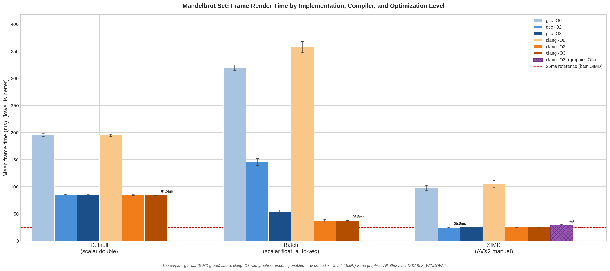

Это учебная задача для сравнения компиляторов (clang vs gcc), их оптимизаторов, а также изучения simd инструкций в рамках курса Ильи Дединского. Полноценное readme будет написано позже, когда у меня будет больше времени. Пока временное readme чисто с минимальным описанием что вообще делалось.

## Репорты

| Название | Папка |
|----------|-------|
| Версия без оптимизации в языке c, с флагом компиляции -O3 | [reports/20260404_005240](reports/20260404_005240) |
| Версия без оптимизации в языке c, с флагом компиляции -Og | [reports/20260404_005618](reports/20260404_005618) |
| Обработка циклами по 4, с -Og | [reports/20260405_165519](reports/20260405_165519) |
| Циклы по 4 с оптимизатором | [reports/20260405_165918](reports/20260405_165918) |
| Пофиксил баг с неправильным расчетом | [reports/20260406_081737](reports/20260406_081737) |
| попытался оптимизировать | [reports/20260406_084309](reports/20260406_084309) |
| попытался оптимизировать с -O3 | [reports/20260406_085559](reports/20260406_085559) |
| Добавил векторизацию через SSE инструкции | [reports/20260406_092901](reports/20260406_092901) |
| Исходная версия с графикой с -O3 | [reports/20260406_093541](reports/20260406_093541) |
| Исходная версия с графикой с -O0 | [reports/20260406_100114](reports/20260406_100114) |
| Исходная версия с отключенной графикой с -O3 | [reports/20260406_100434](reports/20260406_100434) |
| default gcc -O0 no graphics | [reports/20260416_011209](reports/20260416_011209) |
| default gcc -O2 no graphics | [reports/20260416_011416](reports/20260416_011416) |
| default gcc -O3 no graphics | [reports/20260416_011617](reports/20260416_011617) |
| default clang -O3 no graphics | [reports/20260416_011753](reports/20260416_011753) |
| default clang -O2 no graphics | [reports/20260416_012113](reports/20260416_012113) |
| default clang -O0 no graphics | [reports/20260416_012451](reports/20260416_012451) |
| batch clang -O0 | [reports/20260416_013314](reports/20260416_013314) |
| batch clang -O2 ⚠ (скомпилирован с -O0) | [reports/20260416_014037](reports/20260416_014037) |
| batch clang -O3 | [reports/20260416_015122](reports/20260416_015122) |
| batch gcc -O3 | [reports/20260416_015230](reports/20260416_015230) |
| batch gcc -O2 | [reports/20260416_020550](reports/20260416_020550) |
| batch gcc -O0 | [reports/20260416_021134](reports/20260416_021134) |
| simd gcc -O0 | [reports/20260416_021704](reports/20260416_021704) |
| simd gcc -O2 | [reports/20260416_022132](reports/20260416_022132) |
| simd gcc -O3 | [reports/20260416_022235](reports/20260416_022235) |
| simd clang -O3 | [reports/20260416_022319](reports/20260416_022319) |
| simd clang -O2 | [reports/20260416_022356](reports/20260416_022356) |
| simd clang -O0 | [reports/20260416_022557](reports/20260416_022557) |
| simd clang -O0 (повтор) | [reports/20260416_081616](reports/20260416_081616) |
| simd clang -O2 (повтор) | [reports/20260416_081904](reports/20260416_081904) |
| simd clang -O3 with graphics | [reports/20260416_082718](reports/20260416_082718) |
| batch clang -O2 (исправленный замер) | [reports/20260416_083738](reports/20260416_083738) |

## 1. Реализации

Тестировались три версии рендерера:

| ID | Файл | Описание |
|----|------|----------|
| **default** | `default.c` | Скалярный, двойная точность (double), наивный пиксель-за-пикселем |
| **batch** | `batch_simple.c` | Скалярный float, массивы из 8 пикселей для авто-векторизации |
| **simd** | `main.c` | Явные AVX2-интринсики `_mm256_*`, 8 пикселей за одну инструкцию |

Ключевые алгоритмические отличия:
- `default` использует `double` (64 бит), `batch` и `simd` — `float` (32 бит)
- `simd` явно задаёт SIMD-вычисление; `batch` рассчитывает на то, что компилятор сам найдёт параллелизм
- Все три вычисляют идентичные кадры; разница точности (double vs float) не видна глазом при данном масштабе

## 2. Результаты производительности

Время - среднее время кадра за 999 кадров,
Разброс - медианное абсолютное отклонение (MAD = median(abs(x_i - x_mean)))
**Меньше - лучше.**

| Реализация | Компилятор | Оптимизация | Среднее (мс) | MAD (мс) | FPS | Ускорение |
|------------|-----------|-------------|-------------|---------|-----|-----------|
| default | gcc | -O0 | 195.91 | 1.92 | 5.1 | 1.00x <- база |
| default | gcc | -O2 | 85.63 | 0.57 | 11.7 | 2.29x |
| default | gcc | -O3 | 85.54 | 0.60 | 11.7 | 2.29x |
| default | clang | -O0 | 195.09 | 1.39 | 5.1 | 1.00x |
| default | clang | -O2 | 84.50 | 0.56 | 11.8 | 2.32x |
| default | clang | -O3 | 84.45 | 0.56 | 11.8 | 2.32x |
| batch | gcc | -O0 | 319.93 | 3.84 | 3.1 | 0.61x |
| batch | gcc | -O2 | 146.03 | 4.51 | 6.8 | 1.34x |
| batch | gcc | -O3 | 54.21 | 2.08 | 18.4 | 3.61x |
| batch | clang | -O0 | 357.92 | 7.88 | 2.8 | 0.55x |
| batch | clang | -O2 | 37.47 | 2.31 | 26.7 | 5.23x |
| batch | clang | -O3 | 36.48 | 0.90 | 27.4 | 5.37x |
| simd | gcc | -O0 | 97.87 | 3.29 | 10.2 | 2.00x |
| simd | gcc | -O2 | **25.01** | **0.56** | **40.0** | **7.83x** |
| simd | gcc | -O3 | 25.32 | 0.52 | 39.5 | 7.74x |
| simd | clang | -O0 | 105.71 | 3.52 | 9.5 | 1.85x |
| simd | clang | -O2 | 25.33 | 0.52 | 39.5 | 7.73x |
| simd | clang | -O3 | 25.36 | 0.56 | 39.4 | 7.73x |



## 3. Анализ ассемблерного кода

### 3.1 Реализация default (скалярная версия)

| Уровень | Тип инструкций | Ключевое изменение |
|---------|----------------|-------------------|
| -O0 | `vmulsd` xmm | Каждая переменная спиллится на стек; `compute_pixel_color` — реальный вызов функции |
| -O2 (gcc) | `vmulsd` xmm | Инлайнинг; все переменные цикла в регистрах; нет обращений к стеку в горячем цикле |
| -O3 (gcc) | `vmulsd` xmm | Структурно **идентичен -O2** — разница 0.1 мс — шум |
| -O2 (clang) | `vmulsd` xmm | Инлайнинг + **разворот цикла x2**: два полных итерации подряд, в два раза меньше промахов предсказателя ветвлений |
| -O3 (clang) | `vmulsd` xmm | Тот же x2 разворот, что и на -O2; дальнейших улучшений нет |

#### gcc -O0: каждая переменная живёт на стеке

Функции существуют независимо. Переменные хранятся на стеке. Даже `rMAX` читается из стека, а не хранится в регистре.

```asm
; --- gcc -O0: одна итерация цикла Мандельброта (адрес 0x1987) ---
vmovsd -0x48(%rbp),%xmm0          ; X  <- загрузить со стека
vmulsd %xmm0,%xmm0,%xmm0          ; xmm0 = X^2
vmovsd %xmm0,-0x28(%rbp)          ; X^2 -> стек

vmovsd -0x40(%rbp),%xmm0          ; Y  <- загрузить со стека
vmulsd %xmm0,%xmm0,%xmm0          ; xmm0 = Y^2
vmovsd %xmm0,-0x20(%rbp)          ; Y^2 -> стек

vmovsd -0x48(%rbp),%xmm0          ; X  <- перезагрузить
vmulsd -0x40(%rbp),%xmm0,%xmm0    ; xmm0 = X*Y
vmovsd %xmm0,-0x18(%rbp)          ; XY -> стек

vmovsd -0x28(%rbp),%xmm0          ; X^2 <- перезагрузить
vaddsd -0x20(%rbp),%xmm0,%xmm0    ; xmm0 = X^2+Y^2
vcomisd -0x38(%rbp),%xmm0         ; сравнить r^2 с rMAX  <- rMAX тоже из стека!
jae    0x1a09                      ; если r^2 >= rMAX: выход

vmovsd -0x28(%rbp),%xmm0          ; X^2 <- перезагрузить
vsubsd -0x20(%rbp),%xmm0,%xmm0    ; xmm0 = X^2-Y^2
vaddsd -0x50(%rbp),%xmm0,%xmm0    ; xmm0 += P0x  <- новый X
vmovsd %xmm0,-0x48(%rbp)          ; новый X -> стек

vmovsd -0x18(%rbp),%xmm0          ; XY <- перезагрузить
vaddsd %xmm0,%xmm0,%xmm0          ; xmm0 = 2*XY
vaddsd -0x30(%rbp),%xmm0,%xmm0    ; xmm0 += P0y  <- новый Y
vmovsd %xmm0,-0x40(%rbp)          ; новый Y -> стек

movzwl -0x52(%rbp),%eax           ; n <- загрузить (16 бит -> расширить до 32)
add    $0x1,%eax                   ; n++
mov    %ax,-0x52(%rbp)             ; n -> стек
movzwl -0x52(%rbp),%eax           ; n <- перезагрузить (избыточно!)
cmp    -0x74(%rbp),%ax             ; сравнить n с MaxN  <- MaxN тоже из стека!
jl     0x1987                      ; переход на начало цикла
```

**Стоимость одной итерации: 10 загрузок + 6 сохранений + 2 лишние загрузки n + 5 арифм. операций.**
Примерно в 3 раза больше обращений к памяти, чем арифметики. `compute_pixel_color` — это `call`, без инлайнинга.

#### gcc -O2: горячий цикл только из регистров (после инлайнинга)

`compute_mandelbrot` заинлайнился в `main`. Все переменные хранятся в регистрах. Стек затрагивается 1 раз за всю строку.

```asm
; --- gcc -O2: горячий внутренний цикл (адрес 0x1490 в main), 1 итерация ---
; xmm0=X, xmm1=Y  (установлены внешним циклом / предыдущей итерацией)
; xmm3=P0x, xmm4=P0y  (константы строки, загружаются один раз на строку)

0x14e5:  vmulsd %xmm0,%xmm0,%xmm5   ; xmm5 = X^2
         vmulsd %xmm1,%xmm1,%xmm2   ; xmm2 = Y^2
         vmulsd %xmm1,%xmm0,%xmm0   ; xmm0 = X*Y  (X перезаписан — безопасно: X^2 сохранён)
         vaddsd %xmm5,%xmm2,%xmm6   ; xmm6 = r^2 = X^2+Y^2
         vcomisd 0xbc3(%rip),%xmm6  ; сравнить r^2 с rMAX (константа в .rodata)
         jb     0x1490              ; если r^2 < rMAX: продолжить -> шаг обновления

; --- шаг обновления (0x1490, достигается когда точка ещё «живая») ---
0x1490:  vsubsd %xmm5,%xmm2,%xmm1   ; xmm1 = X^2-Y^2
         vaddsd %xmm0,%xmm0,%xmm0   ; xmm0 = 2*(X*Y)
         add    $0x1,%eax            ; n++
         vaddsd %xmm3,%xmm1,%xmm1   ; xmm1 = новый X = X^2-Y^2 + P0x
         vaddsd %xmm4,%xmm0,%xmm0   ; xmm0 = новый Y = 2*XY + P0y
         cmp    $0x100,%ax           ; n vs MaxN (256)
         jne    0x14e5              ; переход на начало
```
**Стоимость одной итерации: 0 загрузок + 0 сохранений + 7 арифм. операций.** Сильно эффективнее чем -O0 (обращение к памяти - самая медленная операция).

#### gcc -O3: структурно идентичен -O2

Цикл не отличается от -O2

#### clang -O2 / -O3: разворот цикла x2

clang разворачивает цикл в 2 раза. Один проход цикла - две полные итерации Мандельброта

```asm
; --- clang -O2: горячий внутренний цикл, 2 итерации на один проход ---
; xmm0=X, xmm2=Y,  xmm5=P0x, xmm7=P0y  (константы строки)

; ── итерация N ────────────────────────────────────────────────
0x1720:  vmulsd %xmm0,%xmm0,%xmm3   ; xmm3 = X^2
         vmulsd %xmm2,%xmm2,%xmm1   ; xmm1 = Y^2
         vaddsd %xmm3,%xmm1,%xmm4   ; xmm4 = r^2 = X^2+Y^2
         vucomisd %xmm6,%xmm4       ; сравнить r^2 с rMAX
         jae    0x1793              ; если r^2 >= rMAX: выход (сохранить n, покрасить)

         vmulsd %xmm0,%xmm2,%xmm2   ; xmm2 = X*Y
         vsubsd %xmm1,%xmm3,%xmm0   ; xmm0 = X^2-Y^2
         vaddsd %xmm0,%xmm5,%xmm0   ; xmm0 = новый X = X^2-Y^2 + P0x
         vaddsd %xmm2,%xmm2,%xmm1   ; xmm1 = 2*(X*Y)
         vaddsd %xmm1,%xmm7,%xmm2   ; xmm2 = новый Y = 2*XY + P0y

; ── итерация N+1 ──────────────────────────────────────────────
         vmulsd %xmm0,%xmm0,%xmm3   ; xmm3 = X^2  (та же последовательность, новые X/Y)
         vmulsd %xmm2,%xmm2,%xmm1   ; xmm1 = Y^2
         vaddsd %xmm3,%xmm1,%xmm4   ; xmm4 = r^2
         vucomisd %xmm6,%xmm4       ; сравнить r^2 с rMAX
         jae    0x1790              ; если r^2 >= rMAX: выход (n+1)

         vmulsd %xmm0,%xmm2,%xmm2   ; xmm2 = X*Y
         vsubsd %xmm1,%xmm3,%xmm0   ; xmm0 = X^2-Y^2
         vaddsd %xmm0,%xmm5,%xmm0   ; xmm0 = новый X
         vaddsd %xmm2,%xmm2,%xmm1   ; xmm1 = 2*XY
         vaddsd %xmm1,%xmm7,%xmm2   ; xmm2 = новый Y

         add    $0x2,%eax           ; n += 2
         cmp    $0x100,%cx          ; n vs MaxN
         jne    0x1720              ; <- обратное ребро: 2 итерации за переход
```

O2 -> O3 не дает никакого прироста, т.к. инлайнинг и так устранил все накладные расходы вызовов функций и все переменные перешли в регистры.

**Сравнение компиляторов:** Разворот цикла clang даёт ему постоянное преимущество в 1.3% (84.5 vs 85.6 мс). Чем можно пренебречь с учетом погрешности измерений.

### 4.2 Реализация batch (float x 8 элементов)

#### gcc -O2: Последовательные скалярные циклы (146 мс)

```asm
vmovss (%r14,%rax,1),%xmm0   ; загрузить X[i]
vmulss %xmm0,%xmm0,%xmm0    ; X[i]^2
vmovss %xmm0,(%rcx,%rax,1)  ; сохранить X2[i]
add    $0x4,%rax
cmp    $0x20,%rax
jne    <loop>
```

8 отдельных последовательных циклов на каждую арифметическую операцию. Векторизации нет.

#### gcc -O3: Регистровое интерлейвинг — 8 скаляров в 8 XMM-регистрах (54 мс)

Развернут цикл i = 0..7, все вычисления происходят в xmm регистрах. Тело цикла - 310 строк умножения всех 8 полос. Векторизации нет.

```asm
vmulss %xmm10,%xmm10,%xmm6   ; X2[полоса0]
vmulss %xmm15,%xmm3,%xmm5    ; XY[полоса6]
...  (8 полос в перемежку)
vcomiss %xmm1,%xmm4
jb <continue_lane0>
...  (8 отдельных vcomiss/jb)
```

**Ноль ymm-регистров** - GCC не применяет AVX2-инструкций. Однако за счет выполнения 8 независимых цепочик умножения, достигается ускорение ~2.7x по сравнению с -O2.

#### clang -O2 -O3: Полноценная AVX2 256-битная авто-векторизация (36 мс)

```asm
vmulps %ymm8,%ymm8,%ymm11    ; X^2 × 8 полос сразу
vmulps %ymm10,%ymm10,%ymm12  ; Y^2 × 8 полос
vmulps %ymm8,%ymm10,%ymm10   ; X*Y × 8 полос
vsubps %ymm12,%ymm11,%ymm8   ; X^2-Y^2 (× 8)
vaddps %ymm10,%ymm10,%ymm10  ; 2*X*Y (× 8)
vaddps 0x180(%rsp),%ymm10,%ymm10  ; + P0y (× 8)
vpaddd %ymm0,%ymm2,%ymm0     ; счётчики итераций++
```

`vmulps ymm` — 1 такт на 8 float.

### 4.3 Реализация simd (явные интринсики `_mm256_*`)

Интринсики 1:1 отображаются в AVX2 инструкции. ymm-регистры присутствуют на каждом уровне оптимизации, но остальной код меняется кардинально.

#### На -O0

Каждый вызов `_mm256_mul_ps()` превращается в: **загрузить ymm со стека → vmulps → сохранить ymm на стек.**
Стековый фрейм занимает ~1500 байт. Несмотря на это, при 97 мс результат почти совпадает со скалярным default O2 (85 мс) — потому что каждый `vmulps ymm` вычисляет 8 пикселей за инструкцию, что позвалает выиграть в расчетах, проиграв в памяти.

#### На -O2 (ключевое улучшение)

Все теперь сохраняется в регистрах. Горячий цикл становится компактным:

```asm
vmulps %ymm2,%ymm2,%ymm8     ; Y^2 × 8
vmulps %ymm0,%ymm0,%ymm1     ; X^2 × 8
vmulps %ymm2,%ymm0,%ymm2     ; X*Y × 8
vaddps %ymm8,%ymm1,%ymm0     ; |z|^2 = X^2+Y^2
vsubps %ymm8,%ymm1,%ymm1     ; X^2-Y^2 (новый X до +P0x)
vaddps %ymm2,%ymm2,%ymm2     ; 2*X*Y
vcmplt_oqps ...,%ymm0,%ymm4  ; маска: ещё в границах?
vpsubd %ymm4,%ymm6,%ymm6     ; счётчик итераций++
vmovmskps %ymm4,%edx
test %edx,%edx
jne  <цикл>
```

Ускорение 3.9x от -O0 до -O2 (97 -> 25 мс) обусловлено устранением стекового хранения переменных, а обращение к памяти - очень медленная операция.

#### На -O3: структурно идентичен -O2

Интринсики полностью определили внутренний цикл, компилятору больше нечего модифицировать. Разница 0.3 мс - погрешность.

#### gcc vs clang

На O2/O3 код идейно идентичный, и поэтому они показывают одинаковую производительность (~25мс). Интринсики убирают свободу компилятора.

### 4. Сравнение компиляторов

**Главный вывод:** Для авто-векторизуемого скалярного кода (batch) clang выигрывает — он генерирует ymm-инструкции уже на -O2, тогда как gcc на -O2 остаётся скалярным. Для явных интринсиков (simd) разница <=1.3%, что является погрешностью и компиляторы пказывают себя абсолютно одинаково.

| Реализация | Оптимизация | gcc (мс) | clang (мс) | Победитель | Delta |
|------------|------------|----------|------------|------------|---|
| default | -O0 | 195.91 | 195.09 | clang | 0.4% |
| default | -O2 | 85.63 | 84.50 | clang | 1.3% |
| default | -O3 | 85.54 | 84.45 | clang | 1.3% |
| batch | -O0 | 319.93 | 357.92 | **gcc** | 10.7% |
| batch | -O2 | 146.03 | 37.47 | **clang** | **74.3%** |
| batch | -O3 | 54.21 | 36.48 | **clang** | **48.6%** |
| simd | -O0 | 97.87 | 105.71 | **gcc** | 7.5% |
| simd | -O2 | 25.01 | 25.33 | **gcc** | 1.3% |
| simd | -O3 | 25.32 | 25.36 | **gcc** | 0.2% |

Но в большинстве случаев компиляторы показывают себя очень близко, и разница в ~5% является чистой погрешностью измерений.